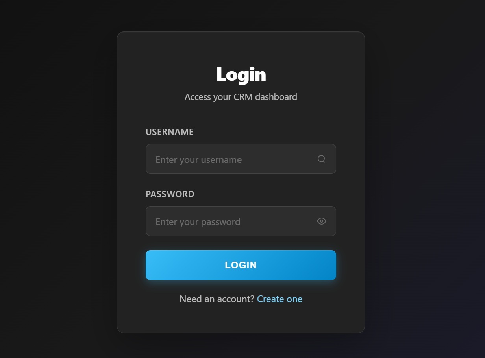
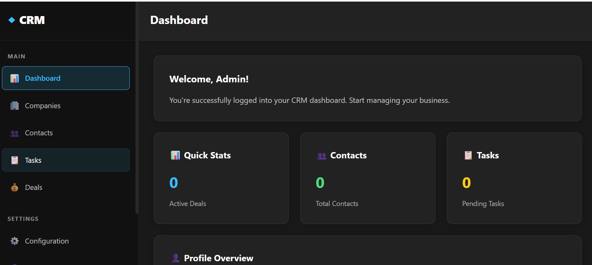
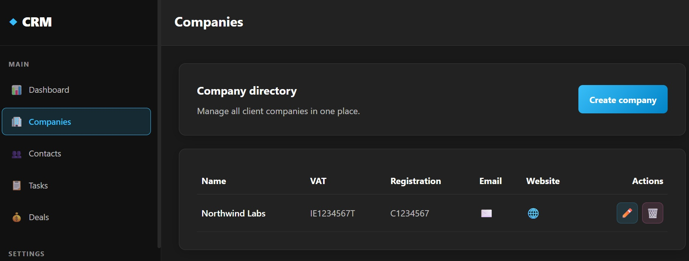

<h3><span style="color:orange">Under development, not production ready yet.</span></h3>

# Simple CRM

This project is a Django CRM app with login, signup, dashboard, profile management, and company administration.

## Screenshots

### Login



### Dashboard



### Companies



## Run locally

### Option 1: Docker Compose

From the project root:

```bash
docker compose up --build
```

Then open:

```text
http://localhost:8000/
```

To stop it:

```bash
docker compose down
```

### Option 2: Local virtual environment

1. Open a terminal in the project root.
2. Create and activate a virtual environment if you want an isolated setup:

   ```bash
   python -m venv .venv
   .venv\Scripts\activate
   ```

3. Install dependencies:

   ```bash
   pip install -r requirements.txt
   ```

4. Change into the Django project directory:

   ```bash
   cd piv
   ```

5. Apply database migrations:

   ```bash
   python manage.py migrate
   ```

6. Start the app:

   ```bash
   python manage.py runserver
   ```

7. Open the app in a browser at:

   ```text
   http://127.0.0.1:8000/
   ```

## Default login and signup

- Signup is available from the login page.
- A user can log in after creating an account or by using an existing Django user.
- The app also includes seeded mock users for local testing if you want sample profile data available in the database.

## Useful commands

Create a superuser:

```bash
python manage.py createsuperuser
```

Run tests:

```bash
python manage.py test crm
```

Collect static files:

```bash
python manage.py collectstatic
```